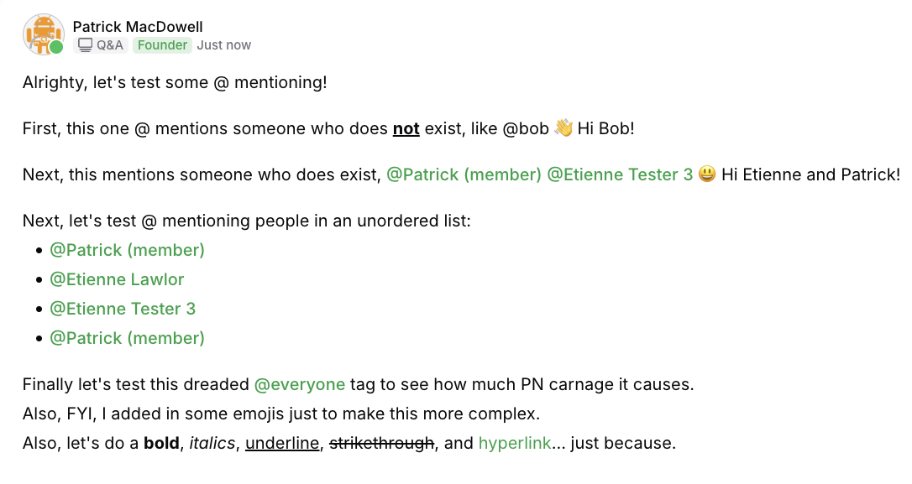

# Adding @ mentions support
The purpose of this doc is to outline the task to add support for @ mentions within the lexical test flow. 

# Data References

## Screenshots
This is a screenshot of what the output looks like when loading it in a web browser. You can see the @ mention logic implemented in it as well as some minor rich text additions.



This is a sample of the desired @ mention styling and appearance:


## Lexical text
This is the formatted lexical text from that screenshot:

```
{"root":{"children":[{"children":[{"detail":0,"format":0,"mode":"normal","style":"","text":"Alrighty, let's test some @ mentioning!","type":"text","version":1}],"direction":"ltr","format":"","indent":0,"type":"paragraph","version":1,"textFormat":0,"textStyle":""},{"children":[],"direction":"ltr","format":"","indent":0,"type":"paragraph","version":1,"textFormat":0,"textStyle":""},{"children":[{"detail":0,"format":0,"mode":"normal","style":"","text":"First, this one @ mentions someone who does ","type":"text","version":1},{"detail":0,"format":9,"mode":"normal","style":"","text":"not","type":"text","version":1},{"detail":0,"format":0,"mode":"normal","style":"","text":" exist, like @bob 👋 Hi Bob! ","type":"text","version":1}],"direction":"ltr","format":"","indent":0,"type":"paragraph","version":1,"textFormat":0,"textStyle":""},{"children":[],"direction":"ltr","format":"","indent":0,"type":"paragraph","version":1,"textFormat":0,"textStyle":""},{"children":[{"detail":0,"format":0,"mode":"normal","style":"","text":"Next, this mentions someone who does exist, ","type":"text","version":1},{"detail":1,"format":0,"mode":"segmented","style":"","text":"@Patrick (member)","type":"mention","version":1,"mentionName":"@Patrick (member)","mentionedUserId":"f6720dfe-0c11-44c9-bb4b-4d39a6cf4d03","alphaName":"pgmacdesignscommunity"},{"detail":0,"format":0,"mode":"normal","style":"","text":" ","type":"text","version":1},{"detail":1,"format":0,"mode":"segmented","style":"","text":"@Etienne Tester 3","type":"mention","version":1,"mentionName":"@Etienne Tester 3","mentionedUserId":"90ebb878-7ed8-4b27-8ebc-ce95216cdb85","alphaName":"pgmacdesignscommunity"},{"detail":0,"format":0,"mode":"normal","style":"","text":" 😃 Hi Etienne and Patrick!","type":"text","version":1}],"direction":"ltr","format":"","indent":0,"type":"paragraph","version":1,"textFormat":0,"textStyle":""},{"children":[],"direction":"ltr","format":"","indent":0,"type":"paragraph","version":1,"textFormat":0,"textStyle":""},{"children":[{"detail":0,"format":0,"mode":"normal","style":"","text":"Next, let's test @ mentioning people in an unordered list:","type":"text","version":1}],"direction":"ltr","format":"","indent":0,"type":"paragraph","version":1,"textFormat":0,"textStyle":""},{"children":[{"children":[{"detail":1,"format":0,"mode":"segmented","style":"","text":"@Patrick (member)","type":"mention","version":1,"mentionName":"@Patrick (member)","mentionedUserId":"f6720dfe-0c11-44c9-bb4b-4d39a6cf4d03","alphaName":"pgmacdesignscommunity"},{"detail":0,"format":0,"mode":"normal","style":"","text":" ","type":"text","version":1}],"direction":null,"format":"","indent":0,"type":"listitem","version":1,"value":1},{"children":[{"detail":1,"format":0,"mode":"segmented","style":"","text":"@Etienne Lawlor","type":"mention","version":1,"mentionName":"@Etienne Lawlor","mentionedUserId":"958abd34-7e2a-4327-9755-d7c02fb6a8fa","alphaName":"pgmacdesignscommunity"},{"detail":0,"format":0,"mode":"normal","style":"","text":" ","type":"text","version":1}],"direction":null,"format":"","indent":0,"type":"listitem","version":1,"value":2},{"children":[{"detail":1,"format":0,"mode":"segmented","style":"","text":"@Etienne Tester 3","type":"mention","version":1,"mentionName":"@Etienne Tester 3","mentionedUserId":"90ebb878-7ed8-4b27-8ebc-ce95216cdb85","alphaName":"pgmacdesignscommunity"},{"detail":0,"format":0,"mode":"normal","style":"","text":" ","type":"text","version":1}],"direction":null,"format":"","indent":0,"type":"listitem","version":1,"value":3},{"children":[{"detail":1,"format":0,"mode":"segmented","style":"","text":"@Patrick (member)","type":"mention","version":1,"mentionName":"@Patrick (member)","mentionedUserId":"f6720dfe-0c11-44c9-bb4b-4d39a6cf4d03","alphaName":"pgmacdesignscommunity"},{"detail":0,"format":0,"mode":"normal","style":"","text":" ","type":"text","version":1}],"direction":null,"format":"","indent":0,"type":"listitem","version":1,"value":4}],"direction":null,"format":"","indent":0,"type":"list","version":1,"listType":"bullet","start":1,"tag":"ul"},{"children":[],"direction":null,"format":"","indent":0,"type":"paragraph","version":1,"textFormat":0,"textStyle":""},{"children":[{"detail":0,"format":0,"mode":"normal","style":"","text":"Finally let's test this dreaded ","type":"text","version":1},{"detail":1,"format":0,"mode":"segmented","style":"","text":"@everyone","type":"mention","version":1,"mentionName":"@everyone","mentionedUserId":"everyone","alphaName":"pgmacdesignscommunity"},{"detail":0,"format":0,"mode":"normal","style":"","text":" tag to see how much PN carnage it causes. ","type":"text","version":1}],"direction":"ltr","format":"","indent":0,"type":"paragraph","version":1,"textFormat":0,"textStyle":""},{"children":[{"detail":0,"format":0,"mode":"normal","style":"","text":"Also, FYI, I added in some emojis just to make this more complex. ","type":"text","version":1}],"direction":"ltr","format":"","indent":0,"type":"paragraph","version":1,"textFormat":0,"textStyle":""},{"children":[{"detail":0,"format":0,"mode":"normal","style":"","text":"Also, let's do a ","type":"text","version":1},{"detail":0,"format":1,"mode":"normal","style":"","text":"bold","type":"text","version":1},{"detail":0,"format":0,"mode":"normal","style":"","text":", ","type":"text","version":1},{"detail":0,"format":2,"mode":"normal","style":"","text":"italics","type":"text","version":1},{"detail":0,"format":0,"mode":"normal","style":"","text":", ","type":"text","version":1},{"detail":0,"format":8,"mode":"normal","style":"","text":"underline","type":"text","version":1},{"detail":0,"format":0,"mode":"normal","style":"","text":", ","type":"text","version":1},{"detail":0,"format":4,"mode":"normal","style":"","text":"strikethrough","type":"text","version":1},{"detail":0,"format":0,"mode":"normal","style":"","text":", and ","type":"text","version":1},{"children":[{"detail":0,"format":0,"mode":"normal","style":"","text":"hyperlink","type":"text","version":1}],"direction":"ltr","format":"","indent":0,"type":"link","version":1,"rel":null,"target":"_blank","title":null,"url":"https://www.google.com"},{"detail":0,"format":0,"mode":"normal","style":"","text":"... just because.","type":"text","version":1}],"direction":"ltr","format":"","indent":0,"type":"paragraph","version":1,"textFormat":0,"textStyle":""},{"children":[{"detail":0,"format":0,"mode":"normal","style":"","text":"Also, here's an edit! ","type":"text","version":1}],"direction":"ltr","format":"","indent":0,"type":"paragraph","version":1,"textFormat":0,"textStyle":""}],"direction":"ltr","format":"","indent":0,"type":"root","version":1}}
```

## Pretty Printed
This is the JSON Pretty printed version for easier reading:
```
{
  "root": {
    "children": [
      {
        "children": [
          {
            "detail": 0,
            "format": 0,
            "mode": "normal",
            "style": "",
            "text": "Alrighty, let's test some @ mentioning!",
            "type": "text",
            "version": 1
          }
        ],
        "direction": "ltr",
        "format": "",
        "indent": 0,
        "type": "paragraph",
        "version": 1,
        "textFormat": 0,
        "textStyle": ""
      },
      {
        "children": [],
        "direction": "ltr",
        "format": "",
        "indent": 0,
        "type": "paragraph",
        "version": 1,
        "textFormat": 0,
        "textStyle": ""
      },
      {
        "children": [
          {
            "detail": 0,
            "format": 0,
            "mode": "normal",
            "style": "",
            "text": "First, this one @ mentions someone who does ",
            "type": "text",
            "version": 1
          },
          {
            "detail": 0,
            "format": 9,
            "mode": "normal",
            "style": "",
            "text": "not",
            "type": "text",
            "version": 1
          },
          {
            "detail": 0,
            "format": 0,
            "mode": "normal",
            "style": "",
            "text": " exist, like @bob 👋 Hi Bob! ",
            "type": "text",
            "version": 1
          }
        ],
        "direction": "ltr",
        "format": "",
        "indent": 0,
        "type": "paragraph",
        "version": 1,
        "textFormat": 0,
        "textStyle": ""
      },
      {
        "children": [],
        "direction": "ltr",
        "format": "",
        "indent": 0,
        "type": "paragraph",
        "version": 1,
        "textFormat": 0,
        "textStyle": ""
      },
      {
        "children": [
          {
            "detail": 0,
            "format": 0,
            "mode": "normal",
            "style": "",
            "text": "Next, this mentions someone who does exist, ",
            "type": "text",
            "version": 1
          },
          {
            "detail": 1,
            "format": 0,
            "mode": "segmented",
            "style": "",
            "text": "@Patrick (member)",
            "type": "mention",
            "version": 1,
            "mentionName": "@Patrick (member)",
            "mentionedUserId": "f6720dfe-0c11-44c9-bb4b-4d39a6cf4d03",
            "alphaName": "pgmacdesignscommunity"
          },
          {
            "detail": 0,
            "format": 0,
            "mode": "normal",
            "style": "",
            "text": " ",
            "type": "text",
            "version": 1
          },
          {
            "detail": 1,
            "format": 0,
            "mode": "segmented",
            "style": "",
            "text": "@Etienne Tester 3",
            "type": "mention",
            "version": 1,
            "mentionName": "@Etienne Tester 3",
            "mentionedUserId": "90ebb878-7ed8-4b27-8ebc-ce95216cdb85",
            "alphaName": "pgmacdesignscommunity"
          },
          {
            "detail": 0,
            "format": 0,
            "mode": "normal",
            "style": "",
            "text": " 😃 Hi Etienne and Patrick!",
            "type": "text",
            "version": 1
          }
        ],
        "direction": "ltr",
        "format": "",
        "indent": 0,
        "type": "paragraph",
        "version": 1,
        "textFormat": 0,
        "textStyle": ""
      },
      {
        "children": [],
        "direction": "ltr",
        "format": "",
        "indent": 0,
        "type": "paragraph",
        "version": 1,
        "textFormat": 0,
        "textStyle": ""
      },
      {
        "children": [
          {
            "detail": 0,
            "format": 0,
            "mode": "normal",
            "style": "",
            "text": "Next, let's test @ mentioning people in an unordered list:",
            "type": "text",
            "version": 1
          }
        ],
        "direction": "ltr",
        "format": "",
        "indent": 0,
        "type": "paragraph",
        "version": 1,
        "textFormat": 0,
        "textStyle": ""
      },
      {
        "children": [
          {
            "children": [
              {
                "detail": 1,
                "format": 0,
                "mode": "segmented",
                "style": "",
                "text": "@Patrick (member)",
                "type": "mention",
                "version": 1,
                "mentionName": "@Patrick (member)",
                "mentionedUserId": "f6720dfe-0c11-44c9-bb4b-4d39a6cf4d03",
                "alphaName": "pgmacdesignscommunity"
              },
              {
                "detail": 0,
                "format": 0,
                "mode": "normal",
                "style": "",
                "text": " ",
                "type": "text",
                "version": 1
              }
            ],
            "direction": null,
            "format": "",
            "indent": 0,
            "type": "listitem",
            "version": 1,
            "value": 1
          },
          {
            "children": [
              {
                "detail": 1,
                "format": 0,
                "mode": "segmented",
                "style": "",
                "text": "@Etienne Lawlor",
                "type": "mention",
                "version": 1,
                "mentionName": "@Etienne Lawlor",
                "mentionedUserId": "958abd34-7e2a-4327-9755-d7c02fb6a8fa",
                "alphaName": "pgmacdesignscommunity"
              },
              {
                "detail": 0,
                "format": 0,
                "mode": "normal",
                "style": "",
                "text": " ",
                "type": "text",
                "version": 1
              }
            ],
            "direction": null,
            "format": "",
            "indent": 0,
            "type": "listitem",
            "version": 1,
            "value": 2
          },
          {
            "children": [
              {
                "detail": 1,
                "format": 0,
                "mode": "segmented",
                "style": "",
                "text": "@Etienne Tester 3",
                "type": "mention",
                "version": 1,
                "mentionName": "@Etienne Tester 3",
                "mentionedUserId": "90ebb878-7ed8-4b27-8ebc-ce95216cdb85",
                "alphaName": "pgmacdesignscommunity"
              },
              {
                "detail": 0,
                "format": 0,
                "mode": "normal",
                "style": "",
                "text": " ",
                "type": "text",
                "version": 1
              }
            ],
            "direction": null,
            "format": "",
            "indent": 0,
            "type": "listitem",
            "version": 1,
            "value": 3
          },
          {
            "children": [
              {
                "detail": 1,
                "format": 0,
                "mode": "segmented",
                "style": "",
                "text": "@Patrick (member)",
                "type": "mention",
                "version": 1,
                "mentionName": "@Patrick (member)",
                "mentionedUserId": "f6720dfe-0c11-44c9-bb4b-4d39a6cf4d03",
                "alphaName": "pgmacdesignscommunity"
              },
              {
                "detail": 0,
                "format": 0,
                "mode": "normal",
                "style": "",
                "text": " ",
                "type": "text",
                "version": 1
              }
            ],
            "direction": null,
            "format": "",
            "indent": 0,
            "type": "listitem",
            "version": 1,
            "value": 4
          }
        ],
        "direction": null,
        "format": "",
        "indent": 0,
        "type": "list",
        "version": 1,
        "listType": "bullet",
        "start": 1,
        "tag": "ul"
      },
      {
        "children": [],
        "direction": null,
        "format": "",
        "indent": 0,
        "type": "paragraph",
        "version": 1,
        "textFormat": 0,
        "textStyle": ""
      },
      {
        "children": [
          {
            "detail": 0,
            "format": 0,
            "mode": "normal",
            "style": "",
            "text": "Finally let's test this dreaded ",
            "type": "text",
            "version": 1
          },
          {
            "detail": 1,
            "format": 0,
            "mode": "segmented",
            "style": "",
            "text": "@everyone",
            "type": "mention",
            "version": 1,
            "mentionName": "@everyone",
            "mentionedUserId": "everyone",
            "alphaName": "pgmacdesignscommunity"
          },
          {
            "detail": 0,
            "format": 0,
            "mode": "normal",
            "style": "",
            "text": " tag to see how much PN carnage it causes. ",
            "type": "text",
            "version": 1
          }
        ],
        "direction": "ltr",
        "format": "",
        "indent": 0,
        "type": "paragraph",
        "version": 1,
        "textFormat": 0,
        "textStyle": ""
      },
      {
        "children": [
          {
            "detail": 0,
            "format": 0,
            "mode": "normal",
            "style": "",
            "text": "Also, FYI, I added in some emojis just to make this more complex. ",
            "type": "text",
            "version": 1
          }
        ],
        "direction": "ltr",
        "format": "",
        "indent": 0,
        "type": "paragraph",
        "version": 1,
        "textFormat": 0,
        "textStyle": ""
      },
      {
        "children": [
          {
            "detail": 0,
            "format": 0,
            "mode": "normal",
            "style": "",
            "text": "Also, let's do a ",
            "type": "text",
            "version": 1
          },
          {
            "detail": 0,
            "format": 1,
            "mode": "normal",
            "style": "",
            "text": "bold",
            "type": "text",
            "version": 1
          },
          {
            "detail": 0,
            "format": 0,
            "mode": "normal",
            "style": "",
            "text": ", ",
            "type": "text",
            "version": 1
          },
          {
            "detail": 0,
            "format": 2,
            "mode": "normal",
            "style": "",
            "text": "italics",
            "type": "text",
            "version": 1
          },
          {
            "detail": 0,
            "format": 0,
            "mode": "normal",
            "style": "",
            "text": ", ",
            "type": "text",
            "version": 1
          },
          {
            "detail": 0,
            "format": 8,
            "mode": "normal",
            "style": "",
            "text": "underline",
            "type": "text",
            "version": 1
          },
          {
            "detail": 0,
            "format": 0,
            "mode": "normal",
            "style": "",
            "text": ", ",
            "type": "text",
            "version": 1
          },
          {
            "detail": 0,
            "format": 4,
            "mode": "normal",
            "style": "",
            "text": "strikethrough",
            "type": "text",
            "version": 1
          },
          {
            "detail": 0,
            "format": 0,
            "mode": "normal",
            "style": "",
            "text": ", and ",
            "type": "text",
            "version": 1
          },
          {
            "children": [
              {
                "detail": 0,
                "format": 0,
                "mode": "normal",
                "style": "",
                "text": "hyperlink",
                "type": "text",
                "version": 1
              }
            ],
            "direction": "ltr",
            "format": "",
            "indent": 0,
            "type": "link",
            "version": 1,
            "rel": null,
            "target": "_blank",
            "title": null,
            "url": "https://www.google.com"
          },
          {
            "detail": 0,
            "format": 0,
            "mode": "normal",
            "style": "",
            "text": "... just because.",
            "type": "text",
            "version": 1
          }
        ],
        "direction": "ltr",
        "format": "",
        "indent": 0,
        "type": "paragraph",
        "version": 1,
        "textFormat": 0,
        "textStyle": ""
      },
      {
        "children": [
          {
            "detail": 0,
            "format": 0,
            "mode": "normal",
            "style": "",
            "text": "Also, here's an edit! ",
            "type": "text",
            "version": 1
          }
        ],
        "direction": "ltr",
        "format": "",
        "indent": 0,
        "type": "paragraph",
        "version": 1,
        "textFormat": 0,
        "textStyle": ""
      }
    ],
    "direction": "ltr",
    "format": "",
    "indent": 0,
    "type": "root",
    "version": 1
  }
}
```

## Additional Data
This is the lexical formatted portion of the code where it is directly @ mentioning someone
```
          {
            "detail": 1,
            "format": 0,
            "mode": "segmented",
            "style": "",
            "text": "@Patrick (member)",
            "type": "mention",
            "version": 1,
            "mentionName": "@Patrick (member)",
            "mentionedUserId": "f6720dfe-0c11-44c9-bb4b-4d39a6cf4d03",
            "alphaName": "pgmacdesignscommunity"
          }
```
This is what we need to utilize. 

## UX Requirements & Acceptance Criteria

### RichSpanStyle.Mention API Properties
The `RichSpanStyle.Mention` class should expose the following properties with getters and setters:

1. **`id`**: String - Unique identifier for the mentioned user (maps to `mentionedUserId` in lexical format)
2. **`fullName`**: String - Full display name for the mentioned user (maps to `mentionName` without @ symbol in lexical format)
3. **`alphaName`**: Nullable String - Context/community identifier (global setter function, omitted from lexical JSON if null)

### Mention Styling Requirements
- External color text support so developers can customize the text color of mentions
- Visual styling should match the reference screenshot provided
- Should be visually distinct from regular text and links
- No image/thumbnail rendering required for this implementation

### Mention Behavior Requirements

#### Parsing/Serialization Focus:
1. **Lexical JSON Parsing**: 
   - Parse mention nodes from lexical JSON format to RichTextState
   - Convert RichTextState mentions back to lexical JSON format
   - Maintain data integrity during roundtrip conversions

2. **Property Mapping**: 
   - Map `mentionedUserId` ↔ `id`
   - Map `mentionName` ↔ `fullName` (handle @ symbol appropriately)
   - Handle `alphaName` with global setter, omit from JSON if null

3. **Non-Editable Atomic Unit**: 
   - Set `acceptNewTextInTheEdges = false` (similar to Link)
   - Mention text should be treated as a single, atomic unit in the editor

#### Future Scope (Not in This Task):
- **Autocomplete/Insertion Behavior**: Will be handled in separate task
- **Click Behavior**: Will be handled in separate task  
- **Advanced Editing Behavior**: Will be handled in separate task

### Sample User Data for Testing
```json
"list_of_users": [
  {
    "id": "bad3dcf6-5a42-4eb6-a296-5e4d0b5fcead",
    "fullName": "Juan Guzman"
  },
  {
    "id": "e479cf04-efb6-48ff-a6d2-b2c576e787ec",
    "fullName": "Juan Guz"
  },
  {
    "id": "d4762846-3199-4d07-a361-b92e7796b964",
    "fullName": "Juan Guzman Admin Two"
  },
  {
    "id": "99e4d5ff-05c5-4159-a202-6c0d97eddd1d",
    "fullName": "Juan Guzman Admin Three"
  }
]
```

## The Task
Now that you have all the data, the goal is to utilize the existing 2 files:
1) com.mohamedrejeb.richeditor.parser.lexical.RichTextStateLexicalParser.kt
2) com.mohamedrejeb.richeditor.parser.lexical.LexicalNode.kt
And add @ mentions support to them. 
Assume that the developer using this library will supply the list of users that could be @ mentioned in a chat. 

## Task Breakdown

### Phase 1: Data Model Updates
1. **Add LexicalMentionNode to LexicalNode.kt**
   - Create a new `LexicalMentionNode` data class that extends `LexicalNode`
   - Include properties: `text`, `mentionName`, `mentionedUserId`, `alphaName`, and all base properties
   - Follow the same pattern as existing nodes (LexicalTextNode, LexicalLinkNode, etc.)
   - Map lexical properties to new RichSpanStyle.Mention API

2. **Add RichSpanStyle.Mention to RichSpanStyle.kt**
   - Create a new `RichSpanStyle.Mention` class with these properties:
     - `id`: String (maps to mentionedUserId)
     - `fullName`: String (maps to mentionName without @ symbol)  
     - `alphaName`: String? (nullable, global setter function)
   - Set `acceptNewTextInTheEdges = false` (non-editable atomic unit)
   - Implement styling that supports external color customization
   - No image rendering required for this implementation

### Phase 2: Parser Updates - JSON to RichTextState
1. **Update parseNodeFromJson() in RichTextStateLexicalParser.kt**
   - Add "mention" case to handle mention type nodes
   - Call new `parseMentionNode()` function

2. **Add parseMentionNode() function**
   - Extract mention-specific fields from JSON (mentionName, mentionedUserId, alphaName)
   - Create and return LexicalMentionNode instance

3. **Update convertLexicalNodeToRichSpans()**
   - Add case for `LexicalMentionNode`
   - Convert to RichSpan with RichSpanStyle.Mention
   - Map lexical mention properties to RichSpanStyle.Mention properties

### Phase 3: Parser Updates - RichTextState to JSON  
1. **Update convertRichSpanToLexical()**
   - Add case for `RichSpanStyle.Mention`
   - Convert RichSpan with mention style to LexicalMentionNode
   - Map RichSpanStyle.Mention properties back to lexical mention properties

2. **Add serializeMentionNodeToJson()**
   - Serialize LexicalMentionNode to JSON string
   - Include all mention-specific fields (mentionName, mentionedUserId, alphaName)
   - Follow the same pattern as other serialization functions

3. **Update serializeLexicalNodeToJson()**
   - Add case for `LexicalMentionNode`
   - Call `serializeMentionNodeToJson()`

### Phase 4: Testing & Validation
1. **Test parsing the provided sample JSON**
   - Use the original lexical JSON with mention nodes from the document
   - Ensure mention nodes are correctly parsed from JSON to RichTextState
   - Verify mention nodes are correctly serialized back to JSON
   - Test roundtrip conversion maintains data integrity
   - Validate mapping between lexical properties and new API properties

2. **Test with sample user data**
   - Create test cases using the provided simplified user JSON data
   - Test mentions with and without alphaName values
   - Verify proper handling of null alphaName (should be omitted from lexical JSON)

3. **Test mention behavior requirements**
   - Test atomic behavior (`acceptNewTextInTheEdges = false`)
   - Verify mention styling and color customization works
   - Test alphaName global setter functionality

4. **Test edge cases**
   - Empty mention fields
   - Special characters in fullNames and alphaName
   - Multiple mentions in same paragraph
   - Mentions in list items
   - Null vs empty string handling for alphaName

### Phase 5: Documentation & Examples
1. **Add usage examples**
   - How to create RichSpanStyle.Mention programmatically with simplified API properties
   - How to map between lexical mention data and RichSpanStyle.Mention
   - Sample code for styling mentions with external color customization
   - Examples of alphaName global setter usage
   
2. **Integration guidance**
   - How developers would integrate the mention parsing/serialization
   - Guidelines for working with the simplified mention data model
   - Best practices for handling lexical JSON roundtrip conversions
   
3. **Behavior documentation**
   - Document atomic behavior (`acceptNewTextInTheEdges = false`)
   - Explain property mapping between lexical and RichSpanStyle formats
   - Provide examples of proper mention parsing implementation

